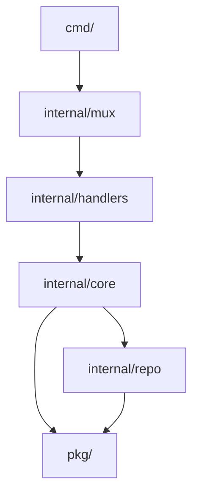

# Projects API

## Running the project locally

### Prerequisites
- Go 1.23+
- Docker & Docker Compose
- `air` (for live reload) - `go install github.com/air-verse/air@latest`

### Setup

1. **Clone the repository** (if you haven't already)

2. **Setup Environment Variables**
   ```bash
   cp .env.example .env
   ```
   Update `.env` with your local configuration.

3. **Start Dependencies**
   Ensure your database and other services are running

4. **Run the Server**
   ```bash
   make dev
   ```
   This command starts the API using `air` for hot-reloading.

5. **Run the Worker**
   ```bash
   make worker
   ```

## Database Migrations

This project uses [golang-migrate](https://github.com/golang-migrate/migrate) for database schema management.

### Install the CLI

```bash
go install -tags 'postgres' github.com/golang-migrate/migrate/v4/cmd/migrate@v4.18.3
```

### Usage

| Command | Description |
|---------|-------------|
| `make migrate-create name=add_users_table` | Create a new migration |
| `make migrate-up` | Apply all pending migrations |
| `make migrate-down n=1` | Rollback last N migrations |
| `make migrate-version` | Show current version |
| `make migrate-force v=2` | Force set version (use with caution) |

**Note:** Set `DB_URL` or the individual env vars (`APP_DB_USER`, `APP_DB_PASSWORD`, `APP_DB_HOST`, `APP_DB_PORT`, `APP_DB_NAME`) before running.

### Best Practices

- Keep migrations small and focused (one logical change per migration)
- Always write both `.up.sql` and `.down.sql` files
- Use `IF NOT EXISTS` / `IF EXISTS` for idempotency
- Test migrations locally before applying to production
- Never edit migrations that have been applied to production

## Database Seeding

The project includes a Go-based seeder to quickly set up a development environment with a user, workspace, and default data (teams, statuses, stories).

### Usage

```bash
# Seed with default values (admin@example.com, "Development" workspace)
make seed

# Seed with custom values
make seed name="My Project" slug="my-project" email="joseph@example.com" fullname="Joseph"
```

The seeder leverages application side-effects, so creating a workspace will automatically:
- Create a default team ("Team 1")
- Create default story statuses
- Create initial "Welcome" stories
- Initialize workspace settings

## Brevo Integration

This service integrates with Brevo (formerly Sendinblue) to manage subscriber onboarding and emails.

### Required Environment Variables

Add this environment variable to your `.env` file:

```bash
# Brevo Configuration
APP_BREVO_API_KEY=your_brevo_api_key_here
```

### How It Works

1. **Onboarding**: When a user registers, they are added to the Brevo contact list (Default List ID: 6).
2. **Trials**: Workspace trial starts add users to the Trial list (Default List ID: 12).
3. **Emails**: System notifications are sent via Brevo's transactional email service.

## Architecture

The Projects API follows a **Hexagonal (or Layered) Architecture** pattern, designed for modularity, testability, and clear separation of concerns.

### System Overview

The system is structured into concentric layers:
1.  **Transport Layer (`cmd`, `internal/mux`, `internal/handlers`)**: Handles HTTP requests, routing, and input validation.
2.  **Domain Layer (`internal/core`)**: Contains pure business logic and interfaces.
3.  **Data Layer (`internal/repo`)**: Implements storage interfaces using SQLx (PostgreSQL).
4.  **Platform/Pkg (`pkg`)**: Shared utilities and third-party integrations (Brevo, AWS, etc.).

### Directory Structure



#### Key Directories

-   **`cmd/`**: Application entry points.
    -   `api/`: The main REST API server.
    -   `worker/`: Background job processor (using Asynq).
-   **`internal/mux`**: Router setup, middleware configuration, and dependency injection root.
-   **`internal/handlers`**: HTTP handlers grouped by domain (e.g., `storiesgrp`, `usersgrp`). Responsible for parsing requests and sending responses.
-   **`internal/core`**: The heart of the application.
    -   Defines domain models (structs).
    -   Defines interfaces for Repositories and Services.
    -   Implements business logic (Services).
-   **`internal/repo`**: Database implementations of the interfaces defined in `core`. Uses `sqlx` for explicitly managed SQL queries.
-   **`pkg/`**: Library code that is not specific to the application's business domain (e.g., `logger`, `database`, `brevo`, `azure`).

### Data Flow

1.  **Request**: An HTTP request hits `cmd/api`, is routed by `internal/mux` to a specific handler in `internal/handlers`.
2.  **Handler**: The handler parses the request payload, validates input, and calls a Service method in `internal/core`.
3.  **Core**: The Service executes business logic (e.g., calculation, permission checks) and calls the Repository interface.
4.  **Repo**: The Repository implementation (`internal/repo`) constructs a SQL query and executes it against PostgreSQL.
5.  **Response**: Data bubbles back up: Repo → Core → Handler → HTTP Response.

### Technology Stack

-   **Language**: Go 1.23+
-   **Database**: PostgreSQL (via `jmoiron/sqlx`)
-   **Caching**: Redis (via `go-redis`)
-   **Background Jobs**: Asynq (Redis-backed queue)
-   **Routing**: Standard `net/http` with custom Mux
-   **Observability**: OpenTelemetry & Slog
-   **Integrations**:
    -   **Brevo**: Email & Transactional messaging
    -   **Google**: OAuth2 Authentication
    -   **Azure**: Blob Storage
    -   **Stripe**: Billing

### Development Patterns

-   **Dependency Injection**: Dependencies are created in `main.go` and passed down explicitly (no global state).
-   **Tracing**: Key operations are wrapped in `web.AddSpan` for observability.
-   **Transactions**: Explicit transaction management (`BeginTxx`) in repositories for multi-step writes.
