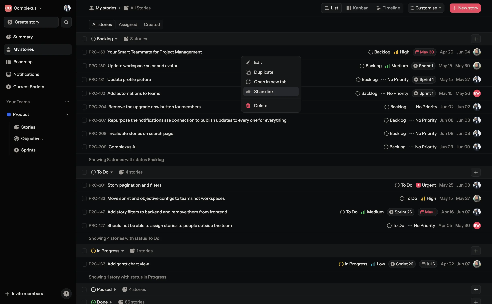
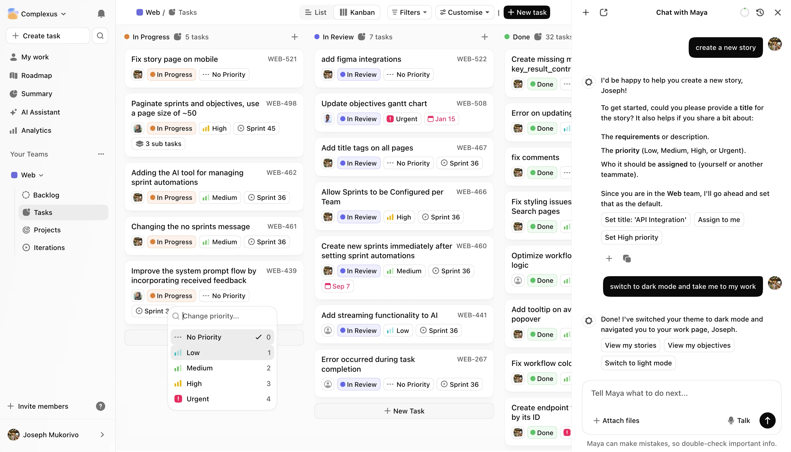
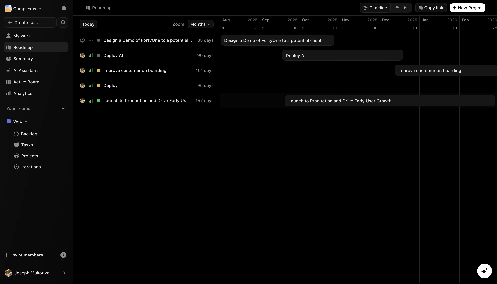

# FortyOne

[](LICENSE)
[](https://nodejs.org/)
[](https://www.typescriptlang.org/)
[](https://nextjs.org/)

A modern, open-source web platform for project management and collaboration. FortyOne provides a comprehensive suite of tools for teams to organize, track, and deliver projects efficiently.

A full-stack, open-source platform for project management and collaboration, with a Go API and multi-app web/mobile clients.

## ✨ Core Features

- **🎯 Project Management**: Organize projects with objectives, key results, and milestones
- **📋 Task Tracking**: Create, assign, and track tasks with rich text editing
- **👥 Team Collaboration**: Real-time collaboration with team members
- **📊 Analytics**: PostHog integration for user analytics and insights
- **🔐 Authentication**: Secure authentication with NextAuth and Google OAuth (projects app)
- **📱 Cross-Platform**: Web application with React Native mobile app
- **🎨 Modern UI**: Built with Radix UI, Tailwind CSS, and Framer Motion
- **⚡ Performance**: Optimized with Next.js 15 and React 19
- **🔍 Search**: Built-in search functionality across all content
- **📚 Documentation**: Comprehensive documentation site with Fumadocs

## 📸 Screenshots

### Core Features

#### 📋 List View - Story Management



#### 📊 Kanban Board - Task Workflow



#### 🎯 OKR Objectives - Goal Tracking



#### 🤖 Maya AI Assistant


## 🚀 Quick Start

```bash
# Clone the repository
git clone https://github.com/complexus/fortyone.git
cd fortyone

# Install dependencies
pnpm install

# Set up environment variables
cp apps/landing/.env.example apps/landing/.env
cp apps/projects/.env.example apps/projects/.env
cp apps/mobile/.env.example apps/mobile/.env
cp apps/server/.env.example apps/server/.env
# Edit .env files with your actual values

# Start development server
pnpm dev
```

Visit the marketing site locally or in production to explore the product. Workspace access and authentication now live in the projects app.

## 📖 Documentation

- **[📚 User Guide](https://docs.fortyone.app)** - Complete documentation
- **[🤝 Contributing](CONTRIBUTING.md)** - How to contribute
- **[🔒 Security](SECURITY.md)** - Security policy and reporting

## 🏗️ Architecture

FortyOne is built as a monorepo using Turborepo with the following structure:

```
fortyone/
├── apps/                    # Applications
│   ├── landing/            # Marketing site
│   ├── docs/               # Documentation site
│   ├── projects/           # Main project management app
│   ├── server/             # Go backend API
│   └── mobile/             # React Native mobile app
├── packages/               # Shared packages
│   ├── ui/                 # Component library
│   ├── lib/                # Shared utilities
│   ├── icons/              # Icon library
│   └── [config]/           # Tooling configurations
└── tools/                  # Development tools
```

## 🤝 Contributing

We welcome contributions! Please see our [Contributing Guide](CONTRIBUTING.md) for details.

### Development

```bash
# Install dependencies
pnpm install

# Start development
pnpm dev

# Run tests
pnpm test

# Lint code
pnpm lint
```

## 📄 License

This project is licensed under the [FortyOne License](LICENSE) - see the [LICENSE](LICENSE) file for details.

The FortyOne License allows free personal and non-commercial use, while requiring commercial licensing for businesses with $200K+ annual revenue.

## 📞 Contact & Support

- **📧 Email**: hello@complexus.tech
- **🐛 Issues**: [GitHub Issues](https://github.com/complexus/fortyone/issues)
- **💬 Discussions**: [GitHub Discussions](https://github.com/complexus/fortyone/discussions)
- **📖 Documentation**: [docs.fortyone.app](https://docs.fortyone.app)

## 🙏 Acknowledgments

- Built with [Next.js](https://nextjs.org/), [React](https://reactjs.org/), and [TypeScript](https://www.typescriptlang.org/)
- UI components by [Radix UI](https://www.radix-ui.com/)
- Analytics by [PostHog](https://posthog.com/)

---

## Prerequisites

Before setting up the development environment, ensure you have the following installed:

### Required Tools

- **Node.js** (v18 or higher) - [Download here](https://nodejs.org/)
- **pnpm** (v9.3.0 or higher) - Install with `npm install -g pnpm`
- **Go** (v1.23 or higher) - [Install Go](https://go.dev/doc/install)

## Local Development Setup

### 1. Clone and Install Dependencies

```bash
git clone <repository-url>
cd fortyone
pnpm install
```

### 2. Start Development Environment

The project includes a unified development command that starts all applications:

```bash
pnpm dev
```

This command will:

- Start all Next.js applications in development mode
- Enable hot reloading across all apps

### 3. Access Applications

Once running, access your applications at:

- **Landing Page**: http://localhost:3000
- **Documentation**: http://localhost:3002
- **Projects App**: http://localhost:3001/{workspace}/...
  - Example workspace: http://localhost:3001/my-workspace/my-work

## Code Structure

This is a Turborepo monorepo with the following structure:

```
fortyone/
├── apps/                    # Applications
│   ├── landing/            # Main landing page (localhost:3000)
│   ├── docs/               # Documentation site (localhost:3002)
│   └── projects/           # Projects management app (localhost:3001/{workspace})
├── packages/               # Shared packages
│   ├── ui/                 # Shared React components
│   ├── icons/              # Icon library
│   ├── lib/                # Shared utilities and helpers
│   ├── tailwind-config/    # Shared Tailwind configuration
│   ├── eslint-config-custom/ # ESLint configuration
│   └── tsconfig/           # TypeScript configurations
└── package.json           # Root package.json with scripts
```

### Applications

#### 🏠 Landing App (`apps/landing/`)

- **Purpose**: Main marketing and landing pages
- **Port**: 3000
- **Tech Stack**: Next.js 15, React 19, Framer Motion, GSAP
- **Features**:
  - MDX content support
  - PostHog analytics
  - Cal.com integration

#### 📚 Docs App (`apps/docs/`)

- **Purpose**: Documentation and guides
- **Port**: 3002
- **Tech Stack**: Next.js 15, Fumadocs
- **Features**:
  - MDX-based documentation
  - Built-in search
  - Code syntax highlighting

#### 🚀 Projects App (`apps/projects/`)

- **Purpose**: Main application for project management and authentication
- **Port**: 3001
- **Tech Stack**: Next.js 16, React 19, TanStack Query, Tiptap
- **Features**:
  - Rich text editing with Tiptap
  - Drag and drop functionality
  - Real-time collaboration
  - Path-based workspace routing (`/[workspaceSlug]/...`)
  - Jest testing setup
  - Docker support

### Shared Packages

#### 🎨 UI Package (`packages/ui/`)

Shared React component library built with:

- Radix UI primitives
- Tailwind CSS for styling
- TypeScript for type safety

#### 🔧 Lib Package (`packages/lib/`)

Shared utilities, helpers, and business logic used across applications.

#### 🎯 Icons Package (`packages/icons/`)

Centralized icon library for consistent iconography across all apps.

#### ⚙️ Configuration Packages

- **tailwind-config**: Shared Tailwind CSS configuration
- **eslint-config-custom**: Custom ESLint rules and configurations
- **tsconfig**: TypeScript configuration presets

## Development Workflow

### Building Applications

```bash
# Build all apps and packages
pnpm build

# Build specific app
pnpm build --filter=landing
pnpm build --filter=docs
pnpm build --filter=projects
```

### Linting and Formatting

```bash
# Lint all packages
pnpm lint

# Format code
pnpm format
```

### Testing

```bash
# Run tests (projects app has Jest setup)
cd apps/projects
pnpm test
```

## Networking Architecture

Applications run on separate ports for development:

- `localhost:3000` (projects)
- `localhost:3001` (landing)
- `localhost:3002` (docs)

This setup allows for:

- **Clean application separation**: Each app runs independently
- **Simplified routing**: Path-based workspace navigation within the projects app
- **Easy development**: No complex proxy configuration needed

## Troubleshooting

### Common Issues

**Port conflicts:**

- Check if ports 3000, 3001, 3002 are available
- Kill conflicting processes: `lsof -ti:3000 | xargs kill`

**Dependencies issues:**

- Clear node_modules: `rm -rf node_modules && pnpm install`
- Clear Turbo cache: `pnpm turbo clean`
