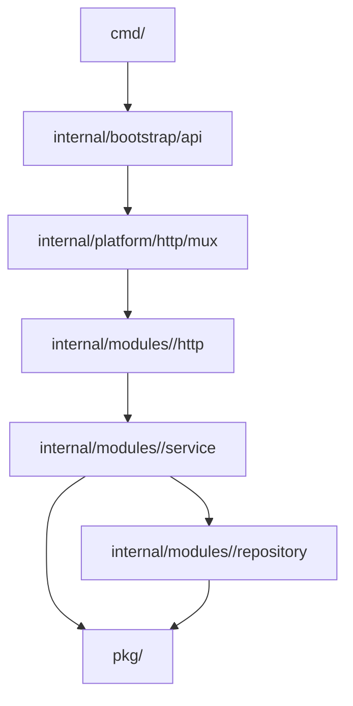

# Projects API

The backend API for FortyOne — a Go service that powers the web and mobile apps in this monorepo.

## Running the project locally

### Prerequisites

- Go 1.23+
- Docker & Docker Compose
- `air` (for live reload) - `go install github.com/air-verse/air@latest`

### Setup

1. **Clone the repository** (if you haven't already)

2. **Setup Environment Variables**

   ```bash
   cp .env.example .env
   ```

   Update `.env` with your local configuration.

3. **Start Dependencies**
   Ensure your database and other services are running

4. **Run the Server**

   ```bash
   make dev
   ```

   This command starts the API using `air` for hot-reloading.

5. **Run the Worker**
   ```bash
   make worker
   ```

## Database Migrations

This project uses [golang-migrate](https://github.com/golang-migrate/migrate) for database schema management.

### Install the CLI

```bash
go install -tags 'postgres' github.com/golang-migrate/migrate/v4/cmd/migrate@v4.18.3
```

### Usage

| Command                                    | Description                          |
| ------------------------------------------ | ------------------------------------ |
| `make migrate-create name=add_users_table` | Create a new migration               |
| `make migrate-up`                          | Apply all pending migrations         |
| `make migrate-down n=1`                    | Rollback last N migrations           |
| `make migrate-version`                     | Show current version                 |
| `make migrate-force v=2`                   | Force set version (use with caution) |

**Note:** Set `DB_URL` or the individual env vars (`APP_DB_USER`, `APP_DB_PASSWORD`, `APP_DB_HOST`, `APP_DB_PORT`, `APP_DB_NAME`) before running.

### Best Practices

- Keep migrations small and focused (one logical change per migration)
- Always write both `.up.sql` and `.down.sql` files
- Use `IF NOT EXISTS` / `IF EXISTS` for idempotency
- Test migrations locally before applying to production
- Never edit migrations that have been applied to production

## Database Seeding

The project includes a Go-based seeder to quickly set up a development environment with a user, workspace, and default data (teams, statuses, stories).

### Usage

```bash
# Seed with default values (admin@example.com, "Development" workspace)
make seed

# Seed with custom values
make seed name="My Project" slug="my-project" email="joseph@example.com" fullname="Joseph Mukorivo"
```

The seeder leverages application side-effects, so creating a workspace will automatically:

- Create a default team ("Team 1")
- Create default story statuses
- Create initial "Welcome" stories
- Initialize workspace settings

## Brevo Integration

This service integrates with Brevo (formerly Sendinblue) to manage subscriber onboarding and emails.

### Required Environment Variables

Add this environment variable to your `.env` file:

```bash
# Brevo Configuration
APP_BREVO_API_KEY=your_brevo_api_key_here
```

### How It Works

1. **Onboarding**: When a user registers, they are added to the Brevo contact list (Default List ID: 6).
2. **Trials**: Workspace trial starts add users to the Trial list (Default List ID: 12).
3. **Emails**: System notifications are sent via Brevo's transactional email service.

## Architecture

The Projects API follows a **domain-first architecture** with clear boundaries between HTTP, domain services, and data access.

### System Overview

The system is organized around domains:

1.  **Entrypoints (`cmd`)**: Starts API, worker, seed, and metrics processes.
2.  **App Wiring (`internal/bootstrap`, `internal/platform/http`)**: Router setup and route registration.
3.  **Domain Modules (`internal/modules/<domain>`)**: Each domain owns `service`, `repository`, and `http` packages.
4.  **Shared Libraries (`pkg`)**: Cross-cutting utilities and third-party integrations.

### Directory Structure



#### Key Directories

- **`cmd/`**: Application entry points.
  - `api/`: The main REST API server.
  - `worker/`: Background job processor (using Asynq).
- **`internal/bootstrap/api`**: API route composition and top-level route registration.
- **`internal/platform/http/mux`**: Router setup and middleware registration.
- **`internal/modules/<domain>/http`**: Domain HTTP handlers (request parsing, validation, response writing).
- **`internal/modules/<domain>/service`**: Domain business logic.
- **`internal/modules/<domain>/repository`**: SQLx-backed persistence for each domain.
  - Repository methods are split into `commands.go` (writes) and `queries.go` (reads) where applicable.
- **`pkg/`**: Library code that is not specific to the application's business domain (e.g., `logger`, `database`, `brevo`, `azure`).

### Data Flow

1.  **Request**: An HTTP request hits `cmd/api`, then passes through `internal/platform/http/mux`.
2.  **Handler**: The domain handler in `internal/modules/<domain>/http` validates input and calls the domain service.
3.  **Service**: The service in `internal/modules/<domain>/service` executes business rules.
4.  **Repository**: The repository in `internal/modules/<domain>/repository` executes SQL queries via SQLx.
5.  **Response**: Data flows back up: Repository → Service → Handler → HTTP response.

### Technology Stack

- **Language**: Go 1.23+
- **Database**: PostgreSQL (via `jmoiron/sqlx`)
- **Caching**: Redis (via `go-redis`)
- **Background Jobs**: Asynq (Redis-backed queue)
- **Routing**: Standard `net/http` with custom Mux
- **Observability**: OpenTelemetry & Slog
- **Integrations**:
  - **Brevo**: Email & Transactional messaging
  - **Google**: OAuth2 Authentication
  - **Azure**: Blob Storage
  - **Stripe**: Billing

### Development Patterns

- **Dependency Injection**: Dependencies are created in `main.go` and passed down explicitly (no global state).
- **Tracing**: Key operations are wrapped in `web.AddSpan` for observability.
- **Transactions**: Explicit transaction management (`BeginTxx`) in repositories for multi-step writes.
- **Boundaries**: `internal/modules/<domain>/service` and `internal/modules/<domain>/repository` must not import HTTP-layer packages.
- **Package Naming**: Domain adapters use explicit package names like `<domain>http` and `<domain>repository`.
